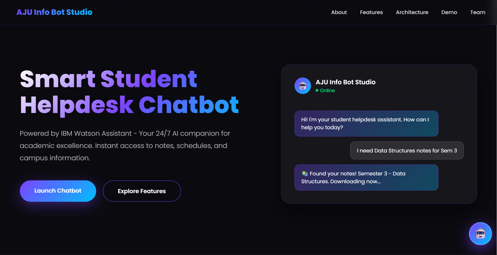
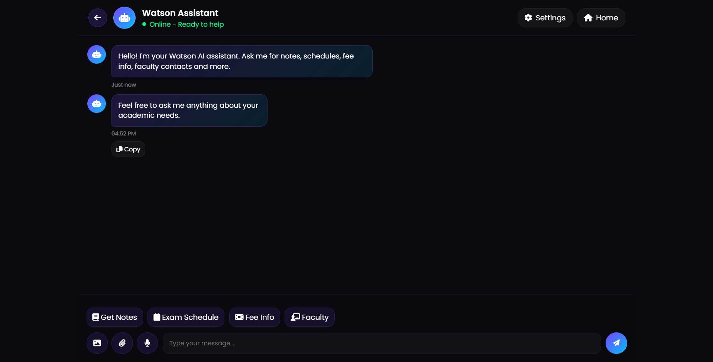

# 🤖 Info-Bot Studio – AI Chatbot for College Website  

📊 A chatbot-based assistant designed to handle student queries using AI integration  

---

## 📌 Overview  
**Info-Bot Studio** is a chatbot-based web application designed to assist students by answering queries related to academics, admissions, and campus information.

The chatbot uses **IBM Watson Assistant** for natural language understanding and provides real-time responses through a web interface.

---

## 📸 Application Preview  

| Chatbot UI | Interaction |
|------------|------------|
|  |  |

---

## 🚀 Features  

- 🤖 AI-powered chatbot using IBM Watson Assistant  
- 💬 Handles student queries in real-time  
- 🌐 REST API built using Flask  
- 🔗 Frontend + backend integration  
- 🖥️ Clean and interactive UI  

---

## 🛠️ Tech Stack  

- **Frontend:** HTML, CSS, JavaScript  
- **Backend:** Python (Flask)  
- **AI Service:** IBM Watson Assistant  
- **Other:** Flask-CORS  

---

## ⚙️ How It Works  

1. User sends message from frontend  
2. Flask backend receives request via API  
3. Message is sent to IBM Watson Assistant  
4. Watson processes input using NLP  
5. Response is returned to backend  
6. Backend sends reply to frontend  

---

## 🔌 API Endpoint  

### POST `/api/message`

**Request:**
```json
{
  "message": "Your query here"
}
